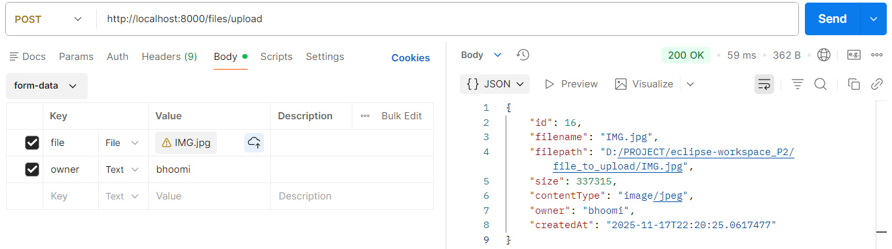
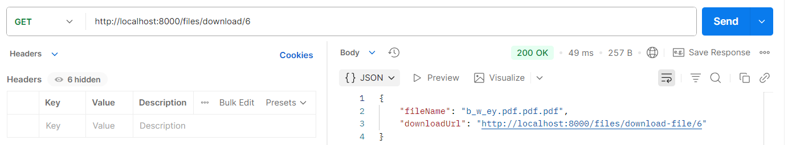
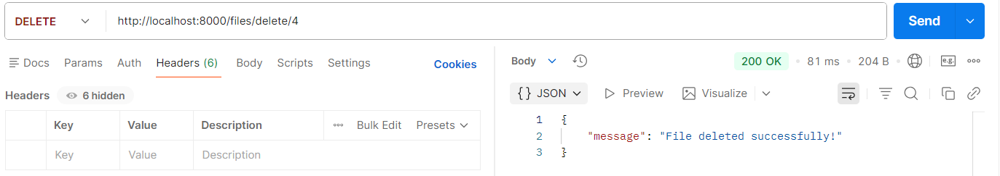

# File-Storage-Service

A lightweight file storage and retrieval system built using **Spring Boot**.  
It allows users to upload files, stores them safely in a local folder and saves metadata(file name, path, size, type, owner) in **MySQL**.
Supports secure file download, automatic download link generation and clean delete operations with disk + DB validation.

This project is a mini **AWS S3–style file storage backend** built using Spring Boot, MySQL, and local filesystem.  
It provides REST endpoints to upload, download, list and delete files.

---

## 🚀 Key Features

- File Upload API using `MultipartFile` (MultipartFile is a Spring Boot interface that represents an uploaded file in a HTTP request.
Used when submitting files from Postman or a form)
- Saves files to a secure local directory
- Stores metadata (filename, path, size, type, timestamp, owner) in MySQL
- Download API returns file bytes 
- Generates dynamic download URL for easy file access
- Delete API checks both disk + DB before removing data
- Clean exception handling and clear JSON responses
- Easily switchable to AWS S3 without changing controller logic

---

## 🛠 Tech Stack

- Spring Boot  
- MySQL (metadata storage)  
- Local filesystem (file storage)  
- JPA / Hibernate 
- Lombok
- Postman (API testing)  

🧰 Development Tools
- Eclipse IDE 
- Postman
- MySQL Workbench
  
---

##📦 Setup Instructions

- Clone the project
  git clone https://github.com/wandkarbhoomika/File-Storage-Service.git

- Create database in MySQL
CREATE DATABASE filedb;

- Configure application.properties

- Run the project
  From Eclipse → Run as → Spring Boot App

## API Endpoints & CURL commands

## 1️ Upload File

POST /files/upload
- Postman (form-data)
- Key: file → Select File
- Key: owner → enter owner name

CURL
curl --location --request POST 'http://localhost:8000/files/upload' \
--form 'file=@"C:/Users/Bhoomika/Downloads/deloitte.pdf"' \
--form 'owner=bhoomi'

Response 
{
    "id": 14,
    "filename": "12",
    "filepath": "D:/PROJECT/eclipse-workspace_P2/file_to_upload/12",
    "size": 323909,
    "contentType": "application/octet-stream",
    "owner": "bhoomi",
    "createdAt": "2025-11-17T22:17:36.2262321"
}

  

## 2 List File

GET /files/list
CURL
postman request 'http://localhost:8000/files/list' \
  --body ''

Response 
[
    {
        "id": 6,
        "filename": "b_w_ey.pdf.pdf.pdf",
        "filepath": "D:/PROJECT/eclipse-workspace_P2/file_to_upload/b_w_ey.pdf.pdf.pdf",
        "size": 96165,
        "contentType": "application/pdf",
        "owner": "bhuvan",
        "createdAt": "2025-11-17T12:40:03"
    },
    {
        "id": 9,
        "filename": "deloitte.pdf.pdf.pdf",
        "filepath": "D:/PROJECT/eclipse-workspace_P2/file_to_upload/deloitte.pdf.pdf.pdf",
        "size": 90001,
        "contentType": "application/pdf",
        "owner": "bhuvan",
        "createdAt": "2025-11-17T15:44:34"
    }
]

  

## 3 Download File

GET /files/download/{id}

This returns:
File name
Dynamic download URL

CURL 
postman request 'http://localhost:8000/files/download/9' \
  --body ''

Reponse 
{
    "fileName": "deloitte.pdf.pdf.pdf",
    "downloadUrl": "http://localhost:8000/files/download-file/9" #Clicking on this link leads another tab in the postman , after clicking on send , in postman response file will be previewd or showed
}

  

## 4 Delete File

Delete /files/delete/{id}

CURL
postman request DELETE 'http://localhost:8000/files/delete/6' \
  --body ''

  

---

## DB Schema
+--------------------+
|  file_metadata     |
+--------------------+
| id (PK)            |
| filename           |
| filepath           |
| size               |
| content_type       |
| owner              |
| created_at         |
+--------------------+

